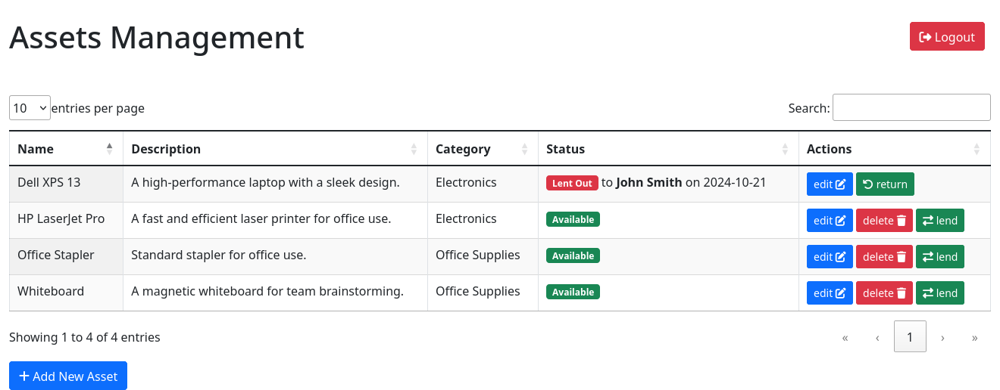

# Django Asset Management System

A Django-based web application that allows companies to manage their assets efficiently. This system offers features like adding, editing, deleting assets, and managing asset lending to employees while enforcing business rules to prevent conflicting borrowing dates.

## Features
- Add, edit, and delete company assets.
- Assign assets to employees and mark them as returned.
- Ensure that assets are not lent out during overlapping timeframes, preventing conflicting dates.

## Screenshots

### Dashboard


<!-- ### Asset Management
 -->

## Prerequisites

Before running this project, make sure you have the following installed:
- Python 3.x
- Django 4.x+
- Virtualenv (optional but recommended)

## Installation and Setup

1. **Clone the repository:**

    ```bash
    git clone git@github.com:mostafanawam/assets_ms.git
    cd assets_ms
    ```

2. **Create and activate a virtual environment:**

    ```bash
    python3 -m venv venv
    source venv/bin/activate  # On Windows: venv\Scripts\activate
    ```

3. **Install the required dependencies:**

    ```bash
    pip install -r requirements.txt
    ```
    or 

    ```bash
    make install
    ```
4. **Apply migrations:**

    ```bash
    python manage.py makemigrations && python manage.py migrate
    ```
    or 

    ```bash
    make setup

5. **Create a superuser for the admin panel:**

    ```bash
    python manage.py createsuperuser
    ```

6. **Run the development server:**

    ```bash
    python manage.py runserver
    ```

7. **Access the app in your browser:**

    Open your web browser and go to `http://127.0.0.1:8000/`.

## Usage

1. Log in to the admin panel using the credentials you set up with the superuser.
2. Add assets, employees, and manage asset lending via the provided interfaces.

<!-- ## Environment Variables

For sensitive settings (like database passwords or secret keys), use a `.env` file in the project root. You can copy the `.env.example` file and update it:

```bash
cp .env.example .env -->
